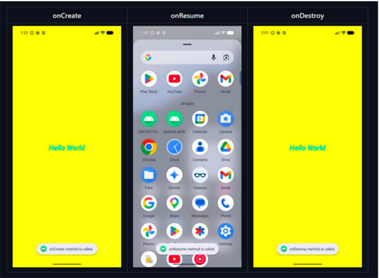
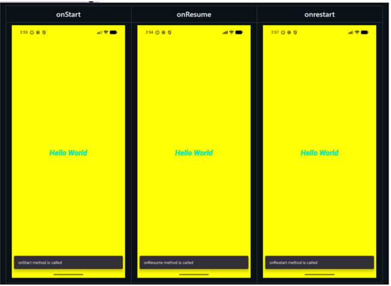
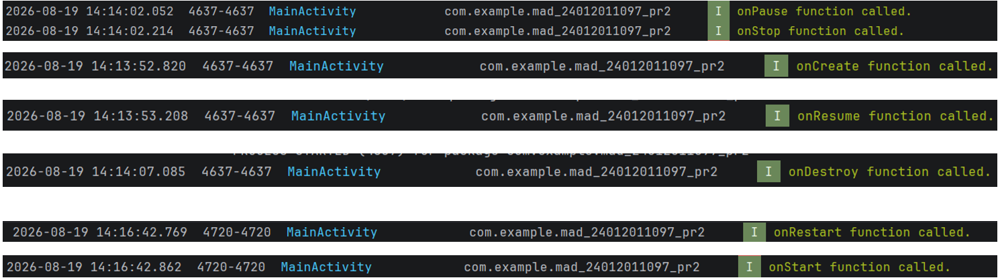

# Practical – 2 : Activity Life Cycle & Basic UI

**Course:** 2CEIT5PE18 – Mobile Application Development
**Name:** Dev Patel
**Enrollment No:** 24012011097
**Package:** `com.example.mad_24012011097_pr2`

---

## AIM

Create an Android Application to demonstrate the functions of the **Activity Life Cycle** and a **Basic UI**.

Display **"Hello World"** in a `TextView`, centered on the screen, with a **yellow** (`#FFFF00`) layout background. The `TextView` should use **Holo Blue Bright** text color, **27sp** font size, and **bold + italic** style. Every Activity lifecycle method (`onCreate`, `onStart`, `onResume`, `onPause`, `onStop`, `onRestart`, `onDestroy`) must be logged via **Logcat**, and shown through a **Toast** and a **Snackbar** message.

---

## UI Implementation Details

| Property | Value |
|---|---|
| Layout | `ConstraintLayout` |
| Background | `#FFFF00` (Yellow) |
| Text | `"Hello World"` |
| Text Color | `@android:color/holo_blue_bright` |
| Text Size | `27sp` |
| Text Style | `bold\|italic` |
| Alignment | Centered (top/bottom/start/end constraints to parent) |

---

## `activity_main.xml`

```xml
<?xml version="1.0" encoding="utf-8"?>
<androidx.constraintlayout.widget.ConstraintLayout
    xmlns:android="http://schemas.android.com/apk/res/android"
    xmlns:app="http://schemas.android.com/apk/res-auto"
    android:id="@+id/main"
    android:layout_width="match_parent"
    android:layout_height="match_parent"
    android:background="#FFFF00">

    <TextView
        android:layout_width="wrap_content"
        android:layout_height="wrap_content"
        android:text="Hello World"
        android:textColor="@android:color/holo_blue_bright"
        android:textSize="27sp"
        android:textStyle="bold|italic"
        app:layout_constraintTop_toTopOf="parent"
        app:layout_constraintBottom_toBottomOf="parent"
        app:layout_constraintStart_toStartOf="parent"
        app:layout_constraintEnd_toEndOf="parent" />

</androidx.constraintlayout.widget.ConstraintLayout>
```

---

## `MainActivity.kt`

```kotlin
package com.example.mad_24012011097_pr2

import android.os.Bundle
import android.util.Log
import android.view.View
import android.widget.Toast
import androidx.activity.enableEdgeToEdge
import androidx.appcompat.app.AppCompatActivity
import androidx.core.view.ViewCompat
import androidx.core.view.WindowInsetsCompat
import com.google.android.material.snackbar.Snackbar

class MainActivity : AppCompatActivity() {


    override fun onCreate(savedInstanceState: Bundle?) {
        super.onCreate(savedInstanceState)
        enableEdgeToEdge()
        setContentView(R.layout.activity_main)

        ViewCompat.setOnApplyWindowInsetsListener(findViewById(R.id.main)) { v, insets ->
            val systemBars = insets.getInsets(WindowInsetsCompat.Type.systemBars())
            v.setPadding(systemBars.left, systemBars.top, systemBars.right, systemBars.bottom)
            insets
        }

        display(msg = "onCreate function called.")
    }

    override fun onStart() {
        display("onStart function called.")
    }

    override fun onPause() {
        display("onPause function called.")
    }

    override fun onResume() {
        super.onResume()
    }

    override fun onStop() {
        display("onStop function called.")
    }

    override fun onRestart() {
        display("onRestart function called.")
    }

    override fun onDestroy() {
        super.onDestroy()
    }

    fun display(msg: String) {
        Toast.makeText(this, msg, Toast.LENGTH_LONG).show()
        val rootView = findViewById<View>(R.id.main)
        if (rootView != null) {
            Snackbar.make(rootView, msg, Snackbar.LENGTH_SHORT).show()
        }
    }
}
```

---

## Output

### 1. Toast Message Simulation (onCreate, onResume, onDestroy)



### 2. Snackbar Message Simulation (onStart, onResume, onRestart)



### 3. LogCat Output (Lifecycle Sequence)



---

## How to Run

1. Open the project in **Android Studio**.
2. Let Gradle sync complete.
3. Run on an emulator or physical device (Pixel 8 / API 30+ recommended).
4. Open **Logcat**, filter by `MainActivity`, and observe the lifecycle logs as you:
    - Launch the app → `onCreate → onStart → onResume`
    - Press **Home** → `onPause → onStop`
    - Reopen from Recents → `onRestart → onStart → onResume`
    - Press **Back** → `onPause → onStop → onDestroy`

---

**Submitted by:** Krish Patel
**Enrollment No:** 24012011097
**Practical:** 02
